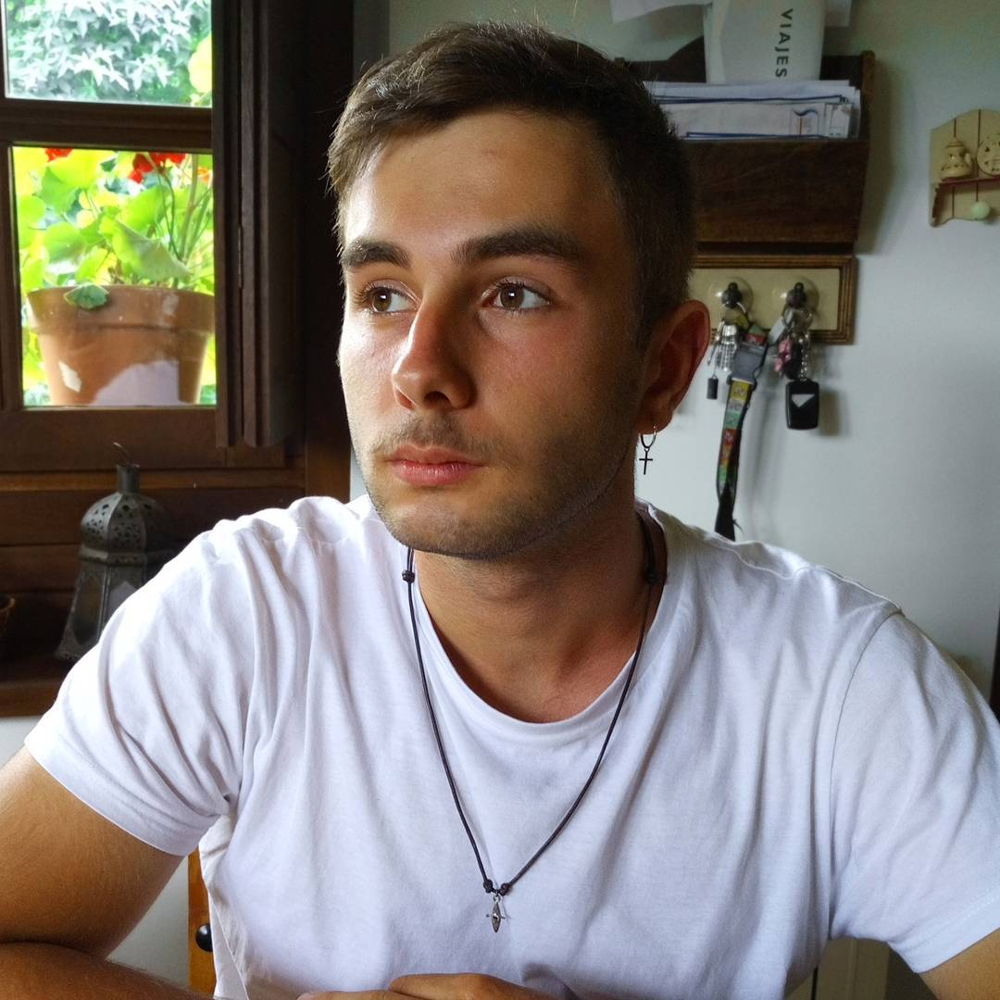

# Lucas Suarez Cabal
  [![forthebadge](data:image/svg+xml;base64,PHN2ZyB4bWxucz0iaHR0cDovL3d3dy53My5vcmcvMjAwMC9zdmciIHdpZHRoPSI5OC4xMSIgaGVpZ2h0PSIzNSIgdmlld0JveD0iMCAwIDk4LjExIDM1Ij48cmVjdCBjbGFzcz0ic3ZnX19yZWN0IiB4PSIwIiB5PSIwIiB3aWR0aD0iNTYuNDciIGhlaWdodD0iMzUiIGZpbGw9IiMyNzlDNDciLz48cmVjdCBjbGFzcz0ic3ZnX19yZWN0IiB4PSI1NC40NyIgeT0iMCIgd2lkdGg9IjQzLjY0IiBoZWlnaHQ9IjM1IiBmaWxsPSIjOEZDOTY1Ii8+PHBhdGggY2xhc3M9InN2Z19fdGV4dCIgZD0iTTE1LjAwIDIyTDEzLjQ2IDIyTDE2LjY4IDEzLjQ3TDE4LjAxIDEzLjQ3TDIxLjI0IDIyTDE5LjY5IDIyTDE4Ljk5IDIwLjAxTDE1LjY5IDIwLjAxTDE1LjAwIDIyWk0xNy4zNCAxNS4yOEwxNi4xMCAxOC44MkwxOC41OCAxOC44MkwxNy4zNCAxNS4yOFpNMjQuOTUgMTguMTNMMjQuOTUgMTguMTNMMjQuOTUgMTcuNDZRMjQuOTUgMTUuNTMgMjUuODcgMTQuNDRRMjYuODAgMTMuMzUgMjguNDYgMTMuMzVMMjguNDYgMTMuMzVRMjkuODggMTMuMzUgMzAuNzIgMTQuMDVRMzEuNTYgMTQuNzYgMzEuNzMgMTYuMDhMMzEuNzMgMTYuMDhMMzAuMjcgMTYuMDhRMzAuMDMgMTQuNTQgMjguNDggMTQuNTRMMjguNDggMTQuNTRRMjcuNDkgMTQuNTQgMjYuOTcgMTUuMjZRMjYuNDUgMTUuOTggMjYuNDMgMTcuMzdMMjYuNDMgMTcuMzdMMjYuNDMgMTguMDJRMjYuNDMgMTkuNDAgMjcuMDIgMjAuMTdRMjcuNjAgMjAuOTMgMjguNjQgMjAuOTNMMjguNjQgMjAuOTNRMjkuNzcgMjAuOTMgMzAuMjUgMjAuNDJMMzAuMjUgMjAuNDJMMzAuMjUgMTguNzVMMjguNTAgMTguNzVMMjguNTAgMTcuNjJMMzEuNzMgMTcuNjJMMzEuNzMgMjAuODlRMzEuMjcgMjEuNTAgMzAuNDUgMjEuODFRMjkuNjMgMjIuMTIgMjguNTggMjIuMTJMMjguNTggMjIuMTJRMjcuNTEgMjIuMTIgMjYuNjkgMjEuNjNRMjUuODYgMjEuMTQgMjUuNDEgMjAuMjRRMjQuOTYgMTkuMzMgMjQuOTUgMTguMTNaTTQxLjkzIDIyTDM2LjM1IDIyTDM2LjM1IDEzLjQ3TDQxLjg5IDEzLjQ3TDQxLjg5IDE0LjY2TDM3LjgzIDE0LjY2TDM3LjgzIDE3LjAyTDQxLjMzIDE3LjAyTDQxLjMzIDE4LjE5TDM3LjgzIDE4LjE5TDM3LjgzIDIwLjgyTDQxLjkzIDIwLjgyTDQxLjkzIDIyWiIgZmlsbD0iI0ZGRkZGRiIvPjxwYXRoIGNsYXNzPSJzdmdfX3RleHQiIGQ9Ik02OS41MSAxNi4xN0w2Ny43NSAxNS4xOVE2OC4yNCAxNC4zNyA2OS4xMyAxMy45MFE3MC4wMiAxMy40MyA3MS4yMyAxMy40M0w3MS4yMyAxMy40M1E3Mi4xOSAxMy40MyA3Mi45MyAxMy43NFE3My42NiAxNC4wNSA3NC4wOCAxNC42NFE3NC40OSAxNS4yMiA3NC40OSAxNS45OUw3NC40OSAxNS45OVE3NC40OSAxNi42NyA3NC4yMCAxNy4yOFE3My45MCAxNy44OSA3My4wNiAxOC42NUw3My4wNiAxOC42NUw3MS40OCAyMC4xMUw3NC43MiAyMC4xMUw3NC43MiAyMkw2OC4xOCAyMkw2OC4xOCAyMC41MUw3MS4zMiAxNy41N1E3MS43OCAxNy4xNCA3MS45NCAxNi44M1E3Mi4wOSAxNi41MyA3Mi4wOSAxNi4yMkw3Mi4wOSAxNi4yMlE3Mi4wOSAxNS44MSA3MS44MiAxNS41OFE3MS41NCAxNS4zNSA3MS4wMSAxNS4zNUw3MS4wMSAxNS4zNVE3MC41NCAxNS4zNSA3MC4xNSAxNS41NlE2OS43NyAxNS43NyA2OS41MSAxNi4xN0w2OS41MSAxNi4xN1pNODAuMTggMTYuMTdMNzguNDIgMTUuMTlRNzguOTEgMTQuMzcgNzkuODAgMTMuOTBRODAuNjkgMTMuNDMgODEuOTAgMTMuNDNMODEuOTAgMTMuNDNRODIuODYgMTMuNDMgODMuNjAgMTMuNzRRODQuMzMgMTQuMDUgODQuNzUgMTQuNjRRODUuMTYgMTUuMjIgODUuMTYgMTUuOTlMODUuMTYgMTUuOTlRODUuMTYgMTYuNjcgODQuODcgMTcuMjhRODQuNTcgMTcuODkgODMuNzMgMTguNjVMODMuNzMgMTguNjVMODIuMTUgMjAuMTFMODUuMzkgMjAuMTFMODUuMzkgMjJMNzguODUgMjJMNzguODUgMjAuNTFMODEuOTkgMTcuNTdRODIuNDUgMTcuMTQgODIuNjEgMTYuODNRODIuNzYgMTYuNTMgODIuNzYgMTYuMjJMODIuNzYgMTYuMjJRODIuNzYgMTUuODEgODIuNDkgMTUuNThRODIuMjEgMTUuMzUgODEuNjggMTUuMzVMODEuNjggMTUuMzVRODEuMjEgMTUuMzUgODAuODIgMTUuNTZRODAuNDQgMTUuNzcgODAuMTggMTYuMTdMODAuMTggMTYuMTdaIiBmaWxsPSIjRkZGRkZGIiB4PSI2Ny40NyIvPjwvc3ZnPg==)](https://forthebadge.com)
## Presentacion

Hola, soy un programador nacido en Pravia, Asturias, con ganas de aprender y especializado en desarrollo de aplicaciones web. Empecé mi aventura como programador en el año 2017 cuando ingresé en la Universidad de Oviedo para estudiar el grado de Ingeniería de Software.

Desde ese día, he dedicado mi vida a intentar aprender todo lo relacionado con el mundo de la informatica, empezando por aprender los lenguajes y entornos de desarrollo mas comunes, pasando por sistemas informaticos y ciberseguridad.

  

Gracias a haber residido en Siauliai, Lituania, tengo un nivel de ingles lo suficientemente fluido como para estar en entornos de trabajo multiculturales, soy de los que piensan que la clave de que un proyecto triunfe o fracase esta en la comunicacion, la sinceridad y la humildad entre miembros de equipo.

## Conocimientos

Actualmente, estoy trabajando en la empresa @neosystems, donde me he espacializado en las siguientes tecnologías:

  

     [HTML](https://img.shields.io/badge/HTML5-E34F26?style=for-the-badge&logo=html5&logoColor=white)

Ademas, tambien tengo algo de experiencia desarrollando bots de  en 